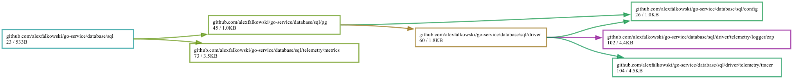
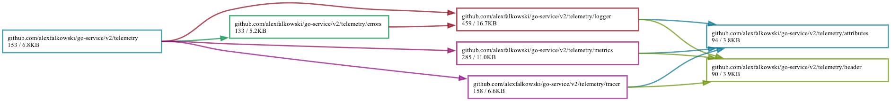
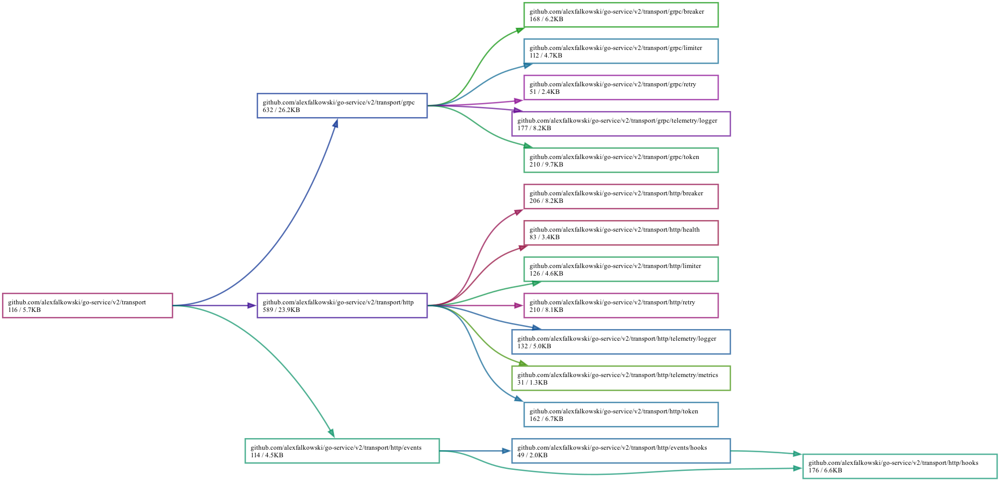
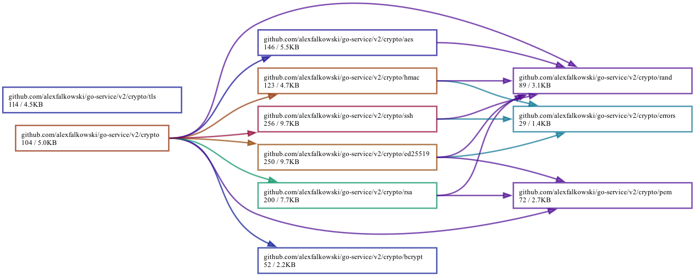

[](https://circleci.com/gh/alexfalkowski/go-service)
[](https://codecov.io/gh/alexfalkowski/go-service)
[](https://goreportcard.com/report/github.com/alexfalkowski/go-service/v2)
[](https://pkg.go.dev/github.com/alexfalkowski/go-service/v2)
[](https://masterminds.github.io/stability/active.html)

# Go Service

A framework to build services in go. This came out of out building services over the years and what I have considered good practices in building services. Hence it is highly subjective and opinionated.

This framework [stands on the shoulder of giants](https://en.wikipedia.org/wiki/Standing_on_the_shoulders_of_giants) so we don't reinvent the wheel!

## Dependency Injection

This framework heavily relies on [DI](https://en.wikipedia.org/wiki/Dependency_injection). We have chosen to use [Uber FX](https://github.com/uber-go/fx). So there is great information online to get you up to speed.

## CLI

A service has commands that are configured using [acmd](https://github.com/cristalhq/acmd). Each service has the following commands:

- `Server` - These are long running apps, e.g daemons.
- `Client` - This are short lived apps, e.g control.

These are configured in the main function.

## Configuration

The supported configuration kinds are as follows:

- [JSON](https://pkg.go.dev/encoding/json)
- [TOML](https://github.com/BurntSushi/toml)
- [YAML](https://github.com/go-yaml/yaml)

The configuration can be read from multiple sources by specifying a flag called `-i`. As per the following:

- `env:CONFIG` - Read from an env variable called `CONFIG`. The env variable must be a configuration and we expect the format of `extension:content`, where `extension` is the supported kinds and `content` contains the contents of the config that is *base64 encoded*.
- `file:path` - Read from the path.
- If all the above fails it will try common locations, such as:
  - The binary location.
  - The `config` folder in your home directory.
  - The `/etc` folder.

The reason for this is that we want to be able to separate how configuration is retrieved.

This is the [configuration](config/config.go). We will outline the config required in each section. The following configuration examples will use YAML.

## Environment

You can specify the environment of the service.

### Paths

In any of the configurations where a path is specified we allow the following:

- `env:CONFIG` - Read from an environment variable.
- `file:path` - Read from a file path.
- `string` - Any arbitrary string.

### Environment Configuration

To configure, please specify the following:

```yaml
environment: development
```

## Compression

We support the following:

- None
- [Zstd](https://github.com/klauspost/compress/tree/master/zstd)
- [S2](https://github.com/klauspost/compress/tree/master/s2)
- [Snappy](https://github.com/klauspost/compress/tree/master/snappy)

## Encoders

We support the following:

- [JSON](https://pkg.go.dev/encoding/json)
- [TOML](https://github.com/BurntSushi/toml)
- [YAML](https://github.com/yaml/go-yaml)
- [Proto](https://google.golang.org/protobuf/proto)
- [GOB](https://pkg.go.dev/encoding/gob)

## Caching

The framework currently supports the following caching solutions from the awesome [Cachego](https://github.com/faabiosr/cachego).

### Compression Configuration

To configure, please specify the following:

```yaml
cache:
  kind: redis | sync
  compressor: none | s2 | zstd | snappy
  encoder: json | toml | yaml | proto | gob
  options:
    url: path to url
```

## Feature

The framework supports [OpenFeature](https://openfeature.dev/).

### Feature Configuration

To configure, please specify the following:

```yaml
feature:
  address: localhost:9000
  retry:
    backoff: 100ms
    timeout: 1s
    attempts: 3
  timeout: 10s
```

## Hooks

The framework supports [Standard Webhooks](https://www.standardwebhooks.com/).

### Hooks Configuration

To configure, please specify the following:

```yaml
hooks:
  secret: path to secret
```

## ID

The framework supports the generation of ids. The following are supported:

- [uuid](https://github.com/google/uuid)
- [ksuid](https://github.com/segmentio/ksuid)
- [nanoid](https://github.com/matoous/go-nanoid)
- [ulid](https://github.com/oklog/ulid)
- [xid](https://github.com/rs/xid)

### ID Configuration

To configure, please specify the following:

```yaml
id:
  kind: uuid | ksuid | nanoid | ulid | xid
```

## Runtime

We enhance the runtime with the following:

- [Automemlimit](https://github.com/KimMachineGun/automemlimit)

## SQL

For SQL databases we support the following:

- [Postgres](https://github.com/jackc/pgx)

We also support master, slave combinations with the awesome [mssqlx](https://github.com/linxGnu/mssqlx).

### SQL Configuration

To configure, please specify the following:

```yaml
sql:
  pg:
    masters:
      -
        url: path to url
    slaves:
      -
        url: path to url
    max_open_conns: 5
    max_idle_conns: 5
    conn_max_lifetime: 1h
```

### Dependencies



## Health

The health package is based on [go-health](https://github.com/alexfalkowski/go-health). This package allows us to create all sorts of ways to check external and internal systems.

We also provide ways to integrate into container integration systems. So we provide the following endpoints:

- `/name/healthz` - This allows us to check any external dependency and provide a breakdown of what is not functioning. This should only be used for verification.
- `/name/livez`: Can be used for k8s [liveness](https://kubernetes.io/docs/tasks/configure-pod-container/configure-liveness-readiness-startup-probes/#define-a-liveness-command).
- `/name/readyz`: Can be used for k8s [readiness](https://kubernetes.io/docs/tasks/configure-pod-container/configure-liveness-readiness-startup-probes/#define-readiness-probes).

This is modelled around [Kubernetes API health endpoints](https://kubernetes.io/docs/reference/using-api/health-checks/).

## Telemetry

Telemetry is broken down in the following sections:

### Logging

For logging we use [slog](https://pkg.go.dev/log/slog).

#### Logging Configuration

We have multiple options for logging.

##### JSON

To configure, please specify the following:

```yaml
telemetry:
  logger:
    kind: json
    level: info
```

##### Text

To configure, please specify the following:

```yaml
telemetry:
  logger:
    kind: text
    level: info
```

##### Logger OTLP

To configure, please specify the following:

```yaml
telemetry:
  logger:
    kind: otlp
    level: info
    url: http://localhost:3100/loki/api/v1/push
    headers:
      Authorization: path to key
```

### Metrics

For metrics we support the following:

- [OpenTelemetry](https://github.com/open-telemetry/opentelemetry-go)
- [Prometheus](https://github.com/prometheus/client_golang)

#### Metrics Configuration

Below is the configuration for each system.

##### Prometheus

To configure, please specify the following:

```yaml
telemetry:
  metrics:
    kind: prometheus
```

##### Metrics OTLP

To configure, please specify the following:

```yaml
telemetry:
  metrics:
    kind: otlp
    url: http://localhost:9009/otlp/v1/metrics
    headers:
      Authorization: path to key
```

### Trace

For distributed tracing we support the following:

- [OpenTelemetry](https://github.com/open-telemetry/opentelemetry-go)

#### Trace Configuration

Below is the configuration for each system.

##### Trace OTLP

To configure, please specify the following:

```yaml
telemetry:
  tracer:
    kind: otlp
    url: localhost:4318
    headers:
      Authorization: path to key
```

### Telemetry Libraries

- <https://pkg.go.dev/go.opentelemetry.io/contrib/instrumentation/runtime>
- <https://pkg.go.dev/go.opentelemetry.io/contrib/instrumentation/host>
- <https://pkg.go.dev/go.opentelemetry.io/contrib/instrumentation/net/http/otelhttp>
- <https://pkg.go.dev/go.opentelemetry.io/contrib/instrumentation/google.golang.org/grpc/otelgrpc>
- <https://github.com/redis/go-redis/tree/master/extra/redisotel>
- <https://github.com/XSAM/otelsql>

### Telemetry Dependencies



## Token

The framework allows you to define different token generators and verifiers.

### Access

We have support for different access controls using [casbin](https://github.com/casbin/casbin).

### JWT

We use the awesome [JWT](https://github.com/golang-jwt/jwt).

### Paseto

We use the awesome [Paseto](https://github.com/aidantwoods/go-paseto).

### SSH

We use the awesome [SSH](https://pkg.go.dev/golang.org/x/crypto/ssh).

## Limiter

The framework allows you to define a [limiter](https://github.com/sethvargo/go-limiter). This will be applied to the different transports.

The different kinds are:

- [user-agent](transport/meta/key.go)
- [ip](transport/meta/key.go)
- [token](transport/meta/key.go)

## Time

The framework allows you use network time services. We use:

- [ntp](https://github.com/beevik/ntp)
- [nts](https://github.com/beevik/nts)

### Time Configuration

To configure, please specify the following:

```yaml
time:
  kind: nts
  address: time.cloudflare.com
```

## Transport

The transport layer provides ways to abstract communication for in/out of the service. So we have the following integrations:

- [gRPC](https://grpc.io/) - The author truly believes in [IDLs](https://en.wikipedia.org/wiki/Interface_description_language).
- [REST](https://github.com/alexfalkowski/go-service/v2/tree/master/net/http/rest) - An abstraction using [content negotiation](https://github.com/elnormous/contenttype).
- [RPC](https://github.com/alexfalkowski/go-service/v2/tree/master/net/http/rpc) - abstraction using [content negotiation](https://github.com/elnormous/contenttype).
- [MVC](https://en.wikipedia.org/wiki/Model%E2%80%93view%E2%80%93controller) - We have a simple [framework](https://github.com/alexfalkowski/go-service/v2/tree/master/net/http/mvc).
- [CloudEvents](https://github.com/cloudevents/sdk-go) - A specification for describing event data in a common way.

### gRPC

Below is list of the provided interceptors:

- [Limiter](https://github.com/sethvargo/go-limiter)

### REST

Below is list of the provided handlers:

- [Limiter](https://github.com/sethvargo/go-limiter)

### Transport Configuration

To configure, please specify the following:

```yaml
transport:
  http:
    address: tcp://localhost:8000
    retry:
      backoff: 100ms
      timeout: 1s
      attempts: 3
    timeout: 10s
  grpc:
    address: tcp://localhost:9000
    retry:
      backoff: 100ms
      timeout: 1s
      attempts: 3
    timeout: 10s
```

If you would like to enable TLS, do the following:

```yaml
transport:
  http:
    tls:
      cert: path of cert
      key: path of key
  grpc:
    tls:
      cert: path of cert
      key: path of key
```

If you would like to enable a limiter, do the following:

```yaml
transport:
  http:
    limiter:
      kind: user-agent
      tokens: 10
      interval: 1s
  grpc:
    limiter:
      kind: user-agent
      tokens: 10
      interval: 1s
```

#### Transport Token Access

To configure, please specify the following:

```yaml
transport:
  http:
    token:
      access:
        policy: path to policy file
  grpc:
    token:
      access:
        policy: path to policy file
```

The model is based on the following [config](https://github.com/casbin/casbin/blob/master/examples/rbac_model.conf).

#### Transport Token JWT

To configure, please specify the following:

```yaml
transport:
  http:
    token:
      kind: jwt
      jwt:
        sub: subject
        aud: audience
        iss: issuer
        exp: 1h
        kid: 1234567890
  grpc:
    token:
      kind: jwt
      jwt:
        sub: subject
        aud: audience
        iss: issuer
        exp: 1h
        kid: 1234567890
```

#### Transport Token Paseto

To configure, please specify the following:

```yaml
transport:
  http:
    token:
      kind: paseto
      paseto:
        sub: subject
        aud: audience
        iss: issuer
        exp: 1h
  grpc:
    token:
      kind: jwt
      paseto:
        sub: subject
        aud: audience
        iss: issuer
        exp: 1h
```

#### Transport Token SSH

To verify, please specify the following:

```yaml
transport:
  http:
    token:
      kind: ssh
      ssh:
        keys:
          - name: test
            public: path to key
  grpc:
    token:
      kind: ssh
      ssh:
        keys:
          - name: test
            public: path to key
```

### Transport Dependencies



## Cryptography

The crypto package provides sensible defaults for symmetric, asymmetric, hashing and randomness.

We rely on the awesome [crypto](https://pkg.go.dev/golang.org/x/crypto).

### Cryptography Configuration

To configure, please specify the following:

```yaml
crypto:
  aes:
    key: path to the key
  ed25519:
    public: path to the public
    private: path to the private
  hmac:
    key: path to the key
  rsa:
    public: path to the public
    private: path to the private
  ssh:
    public: path to the public
    private: path to the private
```

### Cryptography Dependencies



## Debug

This section outlines all utilities added for you troubleshooting abilities.

### statsviz

```http
GET http://localhost:6060/debug/statsviz
```

Check out [statsviz](https://github.com/arl/statsviz).

### pprof

```http
GET http://localhost:6060/debug/pprof/
GET http://localhost:6060/debug/pprof/cmdline
GET http://localhost:6060/debug/pprof/profile
GET http://localhost:6060/debug/pprof/symbol
GET http://localhost:6060/debug/pprof/trace
```

Check out [pprof](https://pkg.go.dev/net/http/pprof).

### fgprof

```http
GET http://localhost:6060/debug/fgprof?seconds=10
```

Check out [fgprof](https://pkg.go.dev/github.com/felixge/fgprof).

### gopsutil

```http
GET http://localhost:6060/debug/psutil
```

Check out [gopsutil](https://github.com/shirou/gopsutil).

### Debug Configuration

To configure, please specify the following:

```yaml
debug:
  address: tcp://localhost:6060
  timeout: 10s
```

If you would like to enable TLS, do the following:

```yaml
debug:
  tls:
    cert: path of cert
    key: path of key
```

## Development

This section describes how to run and contribute to the project, if you are interested.

### Style

We favour what is defined in the [Uber Go Style Guide](https://github.com/uber-go/guide/blob/master/style.md).

### Development Dependencies

Please setup the following:

- <https://github.com/FiloSottile/mkcert>

### Setup

To get yourself setup, please run:

```sh
git submodule sync
git submodule update --init

mkcert -install
make create-certs

make dep
```

### Development Environment

As we rely on external services these need to be configured:

#### Starting

Please run:

```sh
make start
```

#### Stopping

Please run:

```sh
make stop
```

### Testing

To be able to test locally, please run:

```sh
make specs
```
