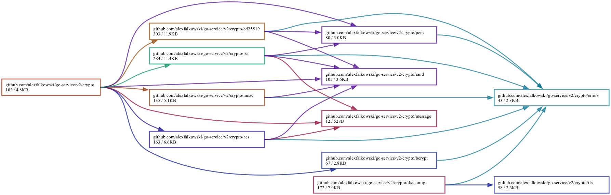

# 🔑 Cryptography

[← Back to README](../README.md)

The crypto root config is `crypto.Config` and supports multiple key types. Most fields are source strings.

Example:

```yaml
crypto:
  aes:
    key: file:test/secrets/aes
  ed25519:
    public: file:test/secrets/ed25519_public
    private: file:test/secrets/ed25519_private
  hmac:
    key: file:test/secrets/hmac
  rsa:
    public: file:test/secrets/rsa_public
    private: file:test/secrets/rsa_private
```

> [!NOTE]
>
> - AES keys must be 16/24/32 bytes after resolving the source string.
> - HMAC keys should be high-entropy secrets and must remain private.
> - RSA keys expect PKCS#1 PEM blocks (`RSA PUBLIC KEY` / `RSA PRIVATE KEY`) and must be at least 4096 bits.
> - Ed25519 expects PKIX `PUBLIC KEY` and PKCS#8 `PRIVATE KEY` PEM blocks.

AES and RSA encryption APIs accept `crypto.Message`. `Data` is encrypted or
decrypted, while `Meta` is authenticated context that must match during
decryption. AES-GCM uses `Meta` as associated data; RSA-OAEP uses it as the
OAEP label.

## Dependencies


