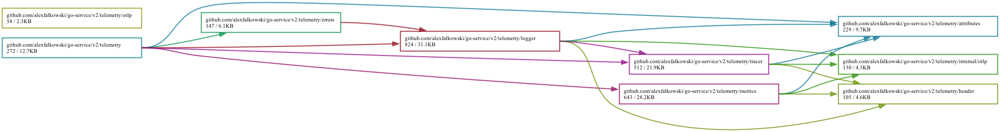

# 📡 Telemetry

[← Back to README](../README.md)

Telemetry config root is `telemetry.Config`:

```yaml
telemetry:
  attributes:
    k8s.namespace.name: payments
  metadata:
    max_value_size: 4KB
  logger: ...
  metrics: ...
  propagation: ...
  tracer: ...
```

`attributes` are plain OpenTelemetry resource labels attached to logs, metrics,
and traces. They are not source strings. Fixed go-service identity attributes
such as `host.id`, `service.instance.id`, `service.name`, `service.version`,
and `deployment.environment.name` take precedence if the same key is
configured.

## Metadata

Request and service metadata is copied from the context to go-service logger
records and trace attributes. Configure the maximum size of each exported value:

```yaml
telemetry:
  metadata:
    max_value_size: 4KB
```

When `max_value_size` is omitted or `0`, each value defaults to 1,024 bytes.
Values are truncated on a UTF-8 boundary only in telemetry; the original value
remains in the request context and transport metadata. Choose a value that fits
the service's log and trace payload budgets: the limit applies to every
metadata-bearing log record and span.

## Propagation

OpenTelemetry context propagation defaults to W3C Trace Context plus W3C Baggage
for extraction and injection:

```yaml
telemetry:
  propagation:
    formats:
      - tracecontext
      - baggage
```

Mixed tracing estates can enable additional formats:

```yaml
telemetry:
  propagation:
    formats:
      - tracecontext
      - baggage
      - b3
```

Supported propagators are `tracecontext`, `baggage`, `b3`, `b3multi`, and
`none`. Use `none` only as the sole value for `formats`.

B3 uses the upstream B3 propagator, which supports both single-header and
multi-header B3 formats.

## Logging

Logging uses `log/slog`.

Supported built-in logger kinds:

- `json`
- `text`
- `tint`
- `otlp`

Supported logger levels are `debug`, `info`, `warn`, and `error`. When `level`
is unset, logging defaults to `info`; unknown values fail logger construction.

### JSON logger

```yaml
telemetry:
  logger:
    kind: json
    level: info
```

### Text logger

```yaml
telemetry:
  logger:
    kind: text
    level: info
```

### OTLP logger

```yaml
telemetry:
  logger:
    kind: otlp
    level: info
    protocol: http
    url: http://localhost:4318/v1/logs
    http_timeout: 10s
    batch_timeout: 5s
    export_timeout: 30s
    max_queue_size: 2048
    max_export_batch_size: 512
    headers:
      Authorization: env:OTLP_LOGS_AUTH
```

> [!NOTE]
> - `batch_timeout`, `export_timeout`, `max_queue_size`, and `max_export_batch_size` tune the OTLP batch export pipeline and apply only when `kind` is `otlp`. When a value is unset or zero, the OpenTelemetry SDK default is used (queue `2048`, batch `512`). A nonzero `batch_timeout` must use whole-second precision. Explicit queue and batch limits may be at most `8192` and `2048`, respectively; the effective batch may not exceed the effective queue.
> - `http_timeout` bounds one OTLP/HTTP export request. It defaults to `10s` when unset or zero and does not apply to OTLP/gRPC.
> - `headers` values are source strings.
> - Telemetry header maps are resolved during config projection; unset `env:` values and unreadable `file:` values fail fast (panic during startup).
> - After resolution, go-service passes header names and values to the selected exporter without validating HTTP or gRPC syntax. Use headers valid for the selected protocol; an exporter may report invalid syntax only when it attempts an export, not during startup.

> [!WARNING]
> OTLP exporters reject non-loopback `http://` endpoints when headers are configured. Use HTTPS for remote collectors that require authorization headers; cleartext with headers is accepted only for local loopback endpoints.
> OTLP/HTTP exporters do not follow redirects; configure the final collector URL.
>
> OTLP/gRPC exporters use `protocol: grpc` and a `host:port` endpoint such as `localhost:4317`. Header-bearing remote gRPC endpoints require the signal's `tls` config; loopback gRPC endpoints may still use cleartext.
>
> OTLP exporter endpoints must be set in go-service config fields such as `telemetry.logger.url`, `telemetry.metrics.url`, and `telemetry.tracer.url`. Standard OpenTelemetry endpoint environment variables such as `OTEL_EXPORTER_OTLP_ENDPOINT` are not used as fallback sources.
> Configure OTLP/HTTP request timeouts and TLS material with `http_timeout` and `tls`; corresponding OpenTelemetry timeout and certificate environment variables are not projected into go-service config.

OTLP exporters can use the same TLS source-string model as other go-service clients. HTTP exporters require an `https://` URL for TLS, while gRPC exporters use `protocol: grpc`:

```yaml
telemetry:
  tracer:
    kind: otlp
    protocol: grpc
    url: collector.example.com:4317
    tls:
      ca: file:/etc/otel/ca.pem
      cert: file:/etc/otel/client.crt
      key: file:/etc/otel/client.key
      server_name: collector.example.com
    headers:
      Authorization: env:OTLP_TRACES_AUTH
```

Use the same `tls` shape under `telemetry.logger` or `telemetry.metrics` for OTLP/HTTPS or OTLP/gRPC.

## Metrics

Supported metrics kinds:

- `prometheus`
- `otlp`

### Prometheus

```yaml
telemetry:
  metrics:
    kind: prometheus
    prometheus:
      without_suffixes: true
      without_target_info: true
      without_scope_info: true
```

When Prometheus is enabled on HTTP transport, metrics are exposed at `/<name>/metrics`.

The optional `prometheus` block shapes exporter output for compatibility with an
existing Prometheus/Grafana/alerting stack. `without_suffixes` drops unit
(for example `_seconds`, `_bytes`) and `_total` counter suffixes from metric
names, `without_target_info` omits the `target_info` metric, and
`without_scope_info` omits the `otel_scope_name`/`otel_scope_version` labels. When
the `prometheus` block is omitted, the exporter keeps its default
OpenTelemetry-conventional output.

### OTLP metrics

```yaml
telemetry:
  metrics:
    kind: otlp
    protocol: http
    url: http://localhost:9009/otlp/v1/metrics
    http_timeout: 10s
    interval: 30s
    timeout: 5s
    headers:
      Authorization: env:OTLP_METRICS_AUTH
```

`interval` and `timeout` apply only to OTLP push metrics. `http_timeout` bounds
an OTLP/HTTP request. When `interval` or `timeout` is unset or zero, the
OpenTelemetry SDK default is used; `http_timeout` defaults to `10s`. A nonzero
`interval` must use whole-second precision.

### Histogram buckets

Override the default histogram bucket boundaries per instrument with an ordered
`telemetry.metrics.views` list. Each `pattern` uses OpenTelemetry name matching,
including `*` wildcards:

```yaml
telemetry:
  metrics:
    views:
      - pattern: http.server.request.duration
        boundaries: [0.005, 0.01, 0.05, 0.1, 0.5, 1, 5]
      - pattern: "rpc.*.duration"
        boundaries: [0.01, 0.1, 1]
```

Boundaries are in the instrument's unit (seconds for duration histograms, bytes
for size histograms) and should be listed in increasing order. Views apply to
histogram instruments regardless of metrics kind; an unset or empty list keeps the
OpenTelemetry SDK default buckets. Views are evaluated in list order; the first
matching view is applied. Migrate the previous map form by making each map entry a
list item with `pattern` and `boundaries` fields.

go-service passes configured boundaries to OpenTelemetry unchanged and does not
validate their order. Boundaries should be increasing: the supported OpenTelemetry SDK reports duplicate or
decreasing boundaries through its global error handler and uses its default
histogram aggregation for the matching instrument; configuration and startup do
not fail.

## Tracing

Tracing supports OTLP exporter config:

```yaml
telemetry:
  tracer:
    kind: otlp
    protocol: http
    url: http://localhost:4318/v1/traces
    http_timeout: 10s
    batch_timeout: 5s
    export_timeout: 30s
    max_queue_size: 2048
    max_export_batch_size: 512
    sampler:
      kind: ratio
      ratio: 0.25
    headers:
      Authorization: env:OTLP_TRACES_AUTH
```

> [!NOTE]
> `batch_timeout`, `export_timeout`, `max_queue_size`, and `max_export_batch_size` tune the OTLP batch span export pipeline. When a value is unset or zero, the OpenTelemetry SDK default is used (queue `2048`, batch `512`). A nonzero `batch_timeout` must use whole-second precision. Explicit queue and batch limits may be at most `8192` and `2048`, respectively; the effective batch may not exceed the effective queue.
>
> `http_timeout` bounds one OTLP/HTTP export request. It defaults to `10s` when unset or zero and does not apply to OTLP/gRPC.
>
> OTLP exporters default to `protocol: http`. Set `protocol: grpc` and use a
> `host:port` `url`, such as `localhost:4317`, to export through OTLP/gRPC.
>
> Supported sampler kinds:
>
> - `always_on`: record every trace.
> - `always_off`: drop every trace.
> - `ratio`: follow an incoming parent span's sampled decision when the request
>   already has trace context; otherwise record the configured fraction of new
>   root traces. Set `ratio` between `0` and `1`, where `0` drops new root
>   traces and `1` records all new root traces.
>
> When `sampler` is omitted, go-service preserves the OpenTelemetry SDK default
> sampler and SDK sampler environment handling.

## Telemetry libraries used

- <https://pkg.go.dev/go.opentelemetry.io/contrib/instrumentation/runtime>
- <https://pkg.go.dev/go.opentelemetry.io/contrib/instrumentation/net/http/otelhttp>
- <https://pkg.go.dev/go.opentelemetry.io/contrib/instrumentation/net/http/httptrace/otelhttptrace>
- <https://pkg.go.dev/go.opentelemetry.io/contrib/instrumentation/google.golang.org/grpc/otelgrpc>
- <https://github.com/redis/go-redis/tree/master/extra/redisotel>
- <https://github.com/XSAM/otelsql>

## Dependencies


