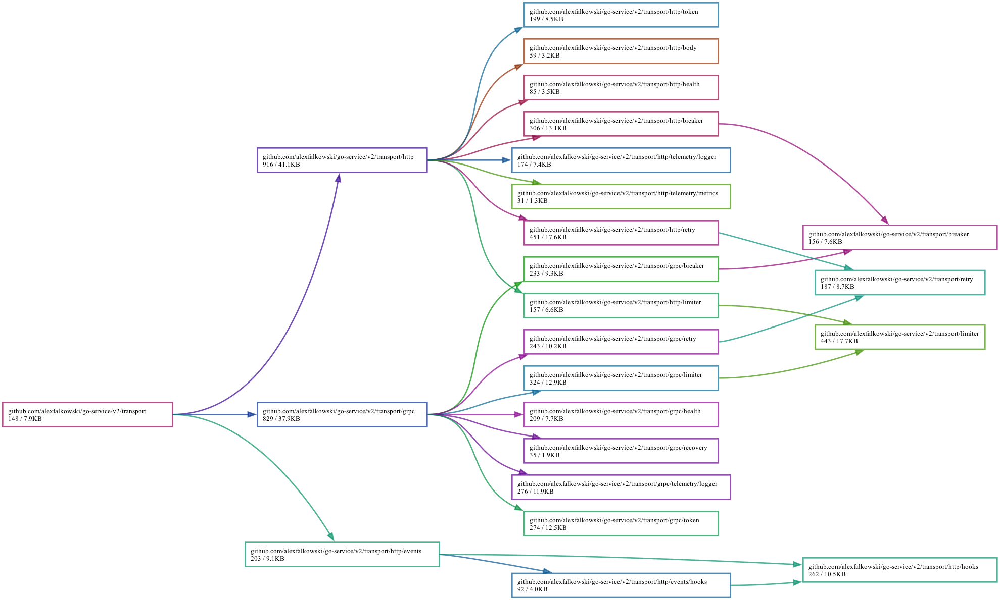

# 🌐 Transport

[← Back to README](../README.md)

The transport layer provides higher-level wiring and middleware policy for communication in/out of the service.

At a high level:

- `transport/...` contains the opinionated service transport layer: Fx wiring, composed HTTP/gRPC server and client stacks, retries, breakers, token middleware, health wiring, and related policy.
- `net/...` contains lower-level protocol helpers and reusable primitives such as `net/http`, `net/grpc`, `net/http/meta`, `net/grpc/meta`, `net/grpc/health`, `net/header`, and `net/server`.

Supported stacks include:

- gRPC (<https://grpc.io/>)
- HTTP REST abstraction (`net/http/rest`) using content negotiation
- HTTP RPC abstraction (`net/http/rpc`) using content negotiation
- HTTP MVC helpers (`net/http/mvc`)
- CloudEvents (<https://github.com/cloudevents/sdk-go>)

CloudEvents HTTP wiring lives under `transport/http/events`: use
`NewReceiver(...).Register(...)` to receive events on a POST route and
`NewSender(...).Send(...)` with `net/http/events.ContextWithTarget(...)` to
send events. The sender uses structured HTTP encoding by default; configure
`WithSenderEncoding(SenderEncodingBinary)` for outbound integrations that
require binary-mode CloudEvents. Webhook-protected receivers require structured
encoding and reject binary-mode CloudEvents with `ce-*` headers before
signature verification. Receiver registration marks the event route as
unauthenticated for transport token/access middleware so webhook verification can
act as the event authentication boundary.

Token and access-control configuration is documented separately in [Tokens](tokens.md).

## HTTP content types

The HTTP REST and RPC helpers decode request bodies from the request `Content-Type`, falling back to JSON when `Content-Type` is absent. An unparseable, unregistered, or intentionally undecodable `Content-Type` is rejected with HTTP 415 rather than falling back to JSON. Response encoding uses the first `Accept` media type when present, falling back to the request `Content-Type` when `Accept` is absent. Client helpers can set `ContentType` for the request body and `Accept` for an independent response format.

Built-in text/object payload media types include:

- `application/json`
- `application/hjson`
- `application/yaml`
- `application/toml`
- `application/octet-stream`, `text/plain`

Internal binary payload media types include:

- `application/vnd.msgpack`
- `application/gob`

Built-in protobuf-oriented media type aliases include:

- `application/proto`, `application/pb`, `application/protobuf`, `application/protobin`, `application/pbbin`
- `application/protojson`, `application/pbjson`
- `application/prototext`, `application/prototxt`, `application/pbtxt`

> [!NOTE]
>
> - `application/hjson` maps to the built-in `hjson` encoder kind.
> - Unknown or invalid media types fall back to JSON selection only for outbound (`Accept`-driven)
>   negotiation. An absent request `Content-Type` still defaults to JSON, but an unknown or invalid one
>   is rejected with HTTP 415 rather than decoded as a different format than the caller declared.
> - `text/error` is reserved for error responses and should not be sent by clients as a request content type.
>
> `application/toml`, `application/vnd.msgpack`, and `application/gob` can be resolved as media types and remain valid
> response codecs, but REST/RPC request-body decoding — for both single-value and streaming
> (NDJSON) requests — rejects them with HTTP 415. This follows the decoder-bounds rule documented in
> `net/http/content/unary`'s package documentation: a codec is admissible for decoding untrusted input only
> when it is both ratio-bounded and depth-bounded, which TOML, msgpack, and gob are not.

## HTTP streaming (NDJSON)

REST and RPC support streaming routes alongside the single-value helpers above, for responses (and,
over HTTP/2, requests) that arrive as a sequence of values instead of one buffered payload:

| single-value                                                                        | streaming                                                                                                   | direction     | HTTP/2 required |
| ----------------------------------------------------------------------------------- | ----------------------------------------------------------------------------------------------------------- | ------------- | --------------- |
| `rest.Server.Get`/`rest.Server.Route`                                               | `rest.Server.StreamGet`/`rest.Server.StreamRoute`                                                           | send-only     | no              |
| `rest.Server.Post`/`rest.Server.Put`/`rest.Server.Patch`/`rest.Server.RouteRequest` | `rest.Server.StreamPost`/`rest.Server.StreamPut`/`rest.Server.StreamPatch`/`rest.Server.StreamRouteRequest` | bidirectional | yes             |
| `rpc.Server.Route`                                                                  | `rpc.Server.StreamRoute`                                                                                    | bidirectional | yes             |

A send-only streaming handler gets a `*stream.Stream[Res]` with `Send`; a bidirectional streaming
handler gets a `*stream.RequestStream[Req, Res]` with both `Send` and `Recv`. Client calls use the
matching `client.Stream`/`client.RequestStream` functions, which take the same kind of callback.
See `net/http/client`'s `ExampleClient_RequestStream` for a complete HTTP/2 bidirectional client call.

## HTTP route policy

Register a raw HTTP handler with `http.Router.HandleRoute` and compose its policy in the same call:

```go
router.HandleRoute(
	"GET /feed",
	handler,
	http.WithRouteOperation(),
	http.WithRouteUnauthenticated(),
)
```

> [!WARNING]
> `http.WithRouteOperation` is for service-owned infrastructure paths, such as the health and metrics routes.
> Operation matching is path-only, so it marks the pattern's path for **every** method — marking `GET /feed`
> also marks a separately registered `POST /feed` — and supported middleware treats an operation route as
> exempt from token verification, access control, and rate limiting, and omits its per-request outcome log
> line. `http.WithRouteUnauthenticated` instead bypasses transport token verification and access control while
> retaining rate limiting and normal outcome logging; use it only when another boundary protects the route.

REST and RPC route helpers accept HTTP route options. Streaming helpers add their inherent stream direction,
and supplied streaming options are additive. MVC accepts only `mvc.WithRouteUnauthenticated` for its view routes.
MVC static helpers keep their `StaticOption` signature; use
`mvc.WithStaticUnauthenticated()` to opt a static route out of authentication.

> [!IMPORTANT]
> Route policy registration now happens only through `HandleRoute`. This intentionally removes the previous
> `Router.Handle*` and mutating `RoutePolicy` registration APIs from v2. Migrate `Router.Handle` to `HandleRoute`
> without options, and migrate specialized registration to `HandleRoute` with the corresponding `WithRoute*` option.
> Replace `IsStreaming` checks with the separate `IsRequestStreaming` and `IsResponseStreaming` checks.

> [!IMPORTANT]
> Single-value helpers live in `github.com/alexfalkowski/go-service/v2/net/http/content/unary`; streaming helpers
> live in `github.com/alexfalkowski/go-service/v2/net/http/content/stream`. Import `unary` for `Content`, `Media`,
> `NewContent`, `NewHandler`, and `NewRequestHandler`; import `stream` for incremental request/response helpers.
> `stream.NewHandler` and `stream.NewRequestHandler` take `*stream.Content`, while unary handlers take
> `*unary.Content`. `rest.NewServer`, `rpc.NewServer`, and `client.NewClient` take the unary and streaming content
> owners separately.
> Migrate root `content` imports and identifiers to `content/unary` and `unary`, respectively; use
> `net/http.ContentTypeKey` and `net/http.AcceptKey` for the shared header names.

The initial wire format is NDJSON (`application/x-ndjson`), newline-delimited JSON values, resolved
through a separate streaming encoder/decoder registry (`encoding/stream.Map`) from the single-value one
above — an unregistered or unparseable streaming media type is rejected outright rather than falling
back to JSON, unlike single-value negotiation.

> [!NOTE]
>
> - Bidirectional streaming routes require HTTP/2 (including h2c); a request over HTTP/1.x is rejected
>   with `505 HTTP Version Not Supported` before the handler runs. Send-only streaming routes have no
>   such requirement and stay fully supported on HTTP/1.1 chunked responses.
> - Streaming responses are not gzip-compressed, regardless of the client's `Accept-Encoding`.
> - `max_receive_size` applies per decoded value on a streaming request body, not as a cumulative total
>   across the whole stream; overall stream volume is controlled by the configured rate limiter instead,
>   which charges one token per streamed message in addition to the token charged when the stream opens.
> - A successful `Send` extends the HTTP server's configured write timeout, and on a bidirectional
>   stream a successful `Recv` extends both the read and write timeouts (and `Send` extends both too),
>   so a slow-but-active stream is not severed by a whole-stream deadline in either direction; bound a
>   client-side streaming call with the request context instead of the client's overall request timeout.
> - The per-message read/write timeouts follow the same `options.read_timeout`/`options.write_timeout`
>   precedence as the server's own timeouts (see [Transport configuration (servers)](#transport-configuration-servers)),
>   falling back to `30s` when the corresponding option is unset.
> - Streaming requests are never retried by the client's retry middleware.
> - A stream failure after the response has committed is recorded as a trace error and in the access log, then
>   aborts the response so clients do not receive a clean but truncated stream. The upstream HTTP server RED
>   metrics do not record aborted streams; use the access log to investigate that failure class.
> - During standard server shutdown, stream handler contexts are canceled. Handlers must return after
>   `ctx.Done()` when waiting on an upstream source; an active `Recv` ends with the drain signal. A blocked
>   `Send` remains subject to the configured write timeout. If the lifecycle shutdown deadline expires, the
>   server force-closes remaining HTTP connections, so clients observe a transport error. A bidirectional
>   HTTP/2 client may observe the forced request-body close as a stream reset and should reconnect to a
>   non-draining server.

## HTTP route misses

The HTTP transport wraps the mux with `net/http.NewNotFoundHandler` so generated 404 responses can be rendered consistently while preserving other mux responses such as 405 Method Not Allowed.

- REST/RPC-style missing routes use `net/http/status.NotFoundHandler`, which writes the standard `status.WriteError` response.
- MVC missing routes can use `mvc.Server.NotFoundHandler` to render the registered MVC not-found view when the request accepts HTML (`Accept: text/html`) or is an HTMX request (`Hx-Request: true`).
- Routes that match and write their own status are not replaced by this mux-level not-found handler.

## HTTP MVC errors

When an MVC controller returns an error, `mvc.Server.Route` renders the returned view with a client-safe `mvc.Error` model. The model contains the HTTP status `Code` and safe client-visible `Message`.

The raw error string remains available to templates as `mvcModelError` metadata for compatibility. Rendering that metadata can expose diagnostic details, so prefer `.Model.Message` for client-visible error pages.

## Transport configuration (servers)

Transport config root is `transport.Config`:

- `transport.http` and `transport.grpc` embed `config/server.Config` and own their unary `timeout` fields.

Minimal example:

```yaml
transport:
  http:
    address: tcp://localhost:8000
    timeout: 10s
  grpc:
    address: tcp://localhost:9000
    timeout: 10s
```

> [!NOTE]
>
> - Address may use `<network>://<address>` (for example `tcp://:8000`) or a raw listen address such as `:8000`, which defaults to the `tcp` network.
> - If address is omitted, defaults are `tcp://:8080` (HTTP) and `tcp://:9090` (gRPC).
> - `transport.http.timeout` bounds non-streaming handler contexts and `transport.grpc.timeout` bounds unary RPC handlers. Both default to `30s` and do not cap stream lifetime; long-lived HTTP and gRPC streams remain governed by client cancellation and their stream-specific controls.
> - HTTP socket deadlines and streaming read/write inactivity budgets are controlled by `transport.http.options.read_timeout`, `write_timeout`, `idle_timeout`, and `read_header_timeout`, each of which defaults independently to `30s`. gRPC connection and keepalive lifetimes are controlled by `transport.grpc.options` and retain their documented lower-level defaults when unset.
> - For gRPC keepalives, `keepalive_ping_time` is the interval between heartbeats and `keepalive_ping_timeout` is the maximum wait for a heartbeat acknowledgement.
> - gRPC limits each client connection to 64 concurrent streams by default. Set `transport.grpc.options.max_concurrent_streams` to a positive base-10 integer to override it, or to `"0"` to explicitly retain upstream's unbounded behavior.
> - HTTP/2 tuning is opt-in through `transport.http.options`: `http2_max_concurrent_streams` is a base-10 `uint32` count (with `"0"` retaining the Go default), while `http2_max_receive_buffer_per_connection` and `http2_max_receive_buffer_per_stream` are size strings. The connection buffer must be at least `65535B`; the stream buffer must be at least `1B`. Both are capped at `math.MaxInt32` (`2147483647B`). Zero or out-of-range buffer values fall back to Go's HTTP/2 default of `1048576B` (1MB).
> - `max_receive_size` limits inbound payload size. A zero value uses the default `4MB`.
> - For HTTP, `max_receive_size` applies per request body, except for bidirectional streaming routes (see [HTTP streaming (NDJSON)](#http-streaming-ndjson)), where it applies per decoded value instead, with no cumulative total. For gRPC, it applies per inbound unary request and per inbound stream message.
> - MVC does not enforce its own body-size caps; supported HTTP server wiring applies `max_receive_size` before MVC handlers run, and go-service HTTP clients apply their configured response-size cap when reading responses.

Receive-limit example:

```yaml
transport:
  http:
    max_receive_size: 2MB
  grpc:
    max_receive_size: 3MB
```

With low-level server options:

```yaml
transport:
  http:
    address: tcp://localhost:8000
    timeout: 10s
    options:
      read_timeout: 10s
      write_timeout: 10s
      idle_timeout: 10s
      read_header_timeout: 10s
      http2_max_concurrent_streams: "128"
      http2_max_receive_buffer_per_connection: 1MB
      http2_max_receive_buffer_per_stream: 512KB
  grpc:
    address: tcp://localhost:9000
    timeout: 10s
    options:
      keepalive_enforcement_policy_ping_min_time: 10s
      keepalive_max_connection_idle: 10s
      keepalive_max_connection_age: 10s
      keepalive_max_connection_age_grace: 10s
      keepalive_ping_time: 10s
      keepalive_ping_timeout: 10s
```

## TLS for transports

TLS config uses `crypto/tls/config.Config` and fields are source strings:

```yaml
transport:
  http:
    tls:
      cert: file:test/certs/cert.pem
      key: file:test/certs/key.pem
      ca: file:test/certs/rootCA.pem
  grpc:
    tls:
      cert: file:test/certs/cert.pem
      key: file:test/certs/key.pem
      ca: file:test/certs/rootCA.pem
```

Set `ca` on server TLS config to require and verify client certificates for mTLS. Set `ca` on client TLS
config to verify server certificates issued by the same local or private CA. `server_name` is only needed
on clients when the dial address differs from the certificate DNS name.

Server-side TLS requires a complete `cert` and `key` pair whenever TLS material is configured. `ca` enables
client-certificate verification for mTLS, but a CA-only server TLS config fails startup.

Runtime servers require TLS 1.3 or newer on inbound handshakes; clients keep a TLS 1.2 floor so outbound
calls stay interoperable with TLS-1.2-only endpoints.

gRPC clients use insecure transport credentials when TLS is not configured. That default is intended for
local or platform-secured traffic; configure client TLS for calls outside that trusted boundary.

> [!IMPORTANT]
> If you are using `go-service-template` or composing server transport bundles such as `module.Server` or `transport.Module`, the required transport registration is handled for you by DI.
>
> `module.Client` does not wire transports by default. When a client process constructs HTTP or gRPC TLS config from source strings such as `file:`, call the relevant transport-level `Register(...)` functions, such as `transport/http.Register(...)` or `transport/grpc.Register(...)`.
>
> You only need to call transport-level `Register(...)` functions yourself when you intentionally wire transports manually or compose lower-level packages outside the transport module graph.
>
> If you are wiring server lifecycle manually, use `net/server.Register(...)`.

## Forwarded IPs and reflection

> [!WARNING]
> HTTP and gRPC metadata extraction intentionally trusts common forwarded IP headers/metadata such as `X-Forwarded-For`, `X-Real-IP`, `CF-Connecting-IP`, and `True-Client-IP`. Services that rely on extracted IPs for logging, policy, or rate limiting should only receive traffic through trusted edge infrastructure that strips or overwrites client-supplied forwarding headers.

> [!WARNING]
> gRPC server reflection is intentionally always registered by `net/grpc.NewServer` so internal tooling can discover services. Services that should not expose reflection publicly should restrict access with bind addresses, TLS/client authentication, ingress policy, firewall rules, or service-mesh authorization.

## Dependencies



## Circuit breakers (client-side)

The transport client wrappers include optional circuit breakers:

- HTTP breaker (`transport/http/breaker`):
  - Scope is per `"<METHOD> <HOST>"`.
  - Default failure statuses are `>=500` and `429`.
  - Requests with an already deadline-exceeded context bypass breaker accounting.
  - Transport errors are counted as failures.
  - Failure status responses are still returned to callers (while breaker accounting records a failure).

- gRPC breaker (`transport/grpc/breaker`):
  - Scope is per `fullMethod`.
  - Default failure codes are `Unavailable`, `DeadlineExceeded`, `ResourceExhausted`, and `Internal`.
  - Errors with other gRPC codes are treated as successful for breaker accounting.

Client config uses the shared `transport/breaker.Config` shape for breaker mechanics. Any config type that
embeds `config/client.Config` has its own `breaker` block under that client config. This example uses
`feature.Config` only because it is one such client config:

```yaml
feature:
  address: localhost:9000
  breaker:
    max_requests: 2
    interval: 15s
    timeout: 5s
    consecutive_failures: 4
```

When manually constructing HTTP or gRPC clients, pass a transport-specific breaker config to
`transport/http.WithClientBreaker(...)` or `transport/grpc.WithClientBreaker(...)`. These configs
embed the shared breaker mechanics and add protocol-specific failure classification:

```go
httpBreaker := httpbreaker.NewConfig(sharedBreaker, 429, 502, 503)
grpcBreaker := grpcbreaker.NewConfig(sharedBreaker, codes.Unavailable, codes.ResourceExhausted)
```

`NewConfig` returns `nil` when the shared breaker config is `nil`, preserving client-option wiring that
disables breakers by omitting breaker config.

`max_requests` controls half-open probe concurrency. `interval` controls the
closed-state count reset window. `timeout` controls how long the breaker stays
open before allowing half-open probes. `consecutive_failures` controls when the
breaker opens. Zero values keep the package defaults.

Instead of (or alongside) `consecutive_failures`, `failure_ratio` and
`min_requests` open the breaker on a sustained error rate rather than an
unbroken run of failures:

```yaml
feature:
  address: localhost:9000
  breaker:
    failure_ratio: 0.5
    min_requests: 10
```

`failure_ratio` is the fraction of failed requests (0 < r <= 1) within the
current `interval` that opens the breaker, evaluated only once `min_requests`
requests have been observed. When `failure_ratio` is set, it takes precedence
over `consecutive_failures`.

HTTP `StatusCodes` and gRPC `Codes` are optional replacement lists for failure
classification. When omitted, the default lists above apply. When set, only the
configured values count as breaker failures, so include the defaults as well
when extending rather than replacing default behavior.

## Client retries

Client config uses the shared `transport/retry.Config` shape for retry mechanics. Any config type that embeds
`config/client.Config` has its own `retry` block under that client config. This example uses `feature.Config`
only because it is one such client config:

```yaml
feature:
  address: localhost:9000
  retry:
    timeout: 1s
    backoff: 100ms
    attempts: 3
    strategy: exponential
```

When manually constructing HTTP or gRPC clients, pass a transport-specific retry config to
`transport/http.WithClientRetry(...)` or `transport/grpc.WithClientRetry(...)`. These configs embed the
shared retry mechanics and add protocol-specific failure classification:

```go
httpRetry := httpretry.NewConfig(sharedRetry, 429, 502, 503)
grpcRetry := grpcretry.NewConfig(sharedRetry, codes.Unavailable, codes.ResourceExhausted)
```

`NewConfig` returns `nil` when the shared retry config is `nil`, preserving client-option wiring that
disables retries by omitting retry config.

`attempts` is the total number of attempts, including the initial call. A value
of `0` or `1` means no retry beyond the first attempt; values above `10` are
rejected during config validation. `backoff` is the base delay between retry
attempts.

`strategy` selects how `backoff` grows between attempts: `constant` (the
default) reuses the base delay for every wait, `exponential` doubles it on each
attempt, and `fibonacci` grows it along the Fibonacci sequence. An unset value
applies `constant`, jitter is applied on top of the chosen strategy, and any
other value is rejected during config validation.

`timeout` is transport-specific. gRPC unary retries apply it per attempt, so
total elapsed time can include multiple attempt timeouts plus backoff unless the
caller context ends first. HTTP retries do not create a retry-owned per-attempt
timeout; bound outbound HTTP calls with the request context or
`http.Client.Timeout`.

`max_backoff` caps the per-attempt backoff duration, applied before jitter. It
is most useful with `exponential` and `fibonacci` growth, which otherwise grow
unbounded across attempts. A zero value (the default) leaves backoff
uncapped:

```yaml
feature:
  address: localhost:9000
  retry:
    backoff: 1s
    strategy: exponential
    attempts: 10
    max_backoff: 30s
```

HTTP `StatusCodes` and gRPC `Codes` are optional replacement lists for failure
classification. When omitted, the default lists below apply. When set, only the
configured values are retryable, so include the defaults as well when extending
rather than replacing default behavior. HTTP values must be 4xx or 5xx status
codes. gRPC values must be non-OK `codes.Code` values.

Default retry policy is intentionally conservative:

- HTTP retries side-effect-safe methods (`GET`, `HEAD`, `OPTIONS`) or requests with a `Request-Id`.
- HTTP retries response/status failures only for `429 Too Many Requests` and `503 Service Unavailable`, plus selected transport errors classified by `retryablehttp.DefaultRetryPolicy`.
- gRPC retries AIP-style read methods named `Get*` or `List*`, or calls with a `Request-Id`.
- gRPC retries only `Unavailable` by default.

HTTP retryable responses with a valid `Retry-After` delay greater than the
minimum jittered backoff suppress another attempt and return the current
response. gRPC retryable status errors with `google.rpc RetryInfo.retry_delay`
use the same suppression policy.

`Request-Id` identifies the logical request, not an individual wire attempt.
Services that allow retried writes should treat it as the idempotency key and
deduplicate repeated attempts when duplicate processing would be unsafe.
